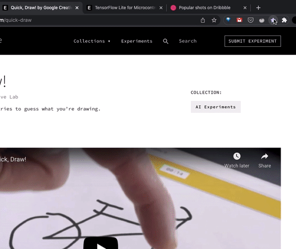

#  Star Links
- A simple chrome extension that saves your links and open tabs
- Built with HTML, CSS and JavaScript

---------

### JS concepts covered:
  - const
  - addEventListeners()
  - innerHTML
  - input.value
  - function parameters
  - template strings
  - localStorage
  - The JSON object
  - objects in arrays
